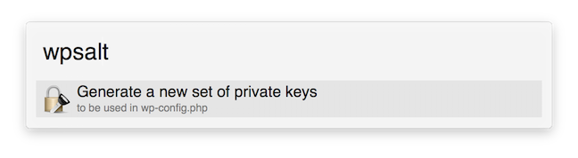

# alfred-wp-secret
Generate new set of secret variables for wordpress wp-config.php

##Download

For an easy installation, you can download the exported workflow here: [wpsalt.alfredworkflow](export/wpsalt.alfredworkflow?raw=true)

##Usage

###Keyword: `wpsalt`

No arguments are required.

If your WordPress site becomes compromised, you should generate a new set of secret keys for your `wp-config.php` file. This will force any users (wanted or unwanted) to be logged out of their session. It would be best to change all passwords first.

The keys will be copied to your clipboard, and can easily be pasted into your `wp-config.php` file.

They will look similar to this:

	define('AUTH_KEY',         '!mnJP1ee~EMOm-dL^pzvU=$+S*c<JzY3W,.I2SPn2RgbEPf/?%M)q+bM6na$+W>o');
	define('SECURE_AUTH_KEY',  'Ky|ykT_-y={*4|9jQ%]5*%z|*x-s7u8<+TF{#:gCR|.kE,mhSS(CwQCNSG>Z[G+)');
	define('LOGGED_IN_KEY',    '[AnG-Z(bR;P,*o-mkt#%MmY]&sp#d0M-lRc_X%Gp| Sp@Cf>#YUccjJHvEqzu_,T');
	define('NONCE_KEY',        '@R4Rgg>aB^)_I;KobP/x|/o&y<5L~f!;an>uZ[?)qY+=RARNpk0t/-gzL=-e0,45');
	define('AUTH_SALT',        '{/xwbl{YIsZig0hKYCE5)sbz[0+UM21H{oB+~4U)Ba2wYaOCV{*l=-(*a{ZumEpH');
	define('SECURE_AUTH_SALT', ')c<HzwZ<au,[7YsAt*yu|Ft*)--=]D%P@ :1-D`L4z;=SPpjQ3_L2,piw9#C1PMe');
	define('LOGGED_IN_SALT',   '-Pf$wx2<xh6Q&qb?&k)+0&b*/VWP659w}oqzR++4gYqiJ,/BK7e*bkR9s.GgO=ns');
	define('NONCE_SALT',       'hsg.kf5} M$hy 5Z#zb++>BC|^ILE#L$&)#Y;ivNaQ(]q/g/[5^IqV|M~(:h|aY~');

The keys can also be manually retrieved from: `https://api.wordpress.org/secret-key/1.1/salt/`

####v1.0
Initial release